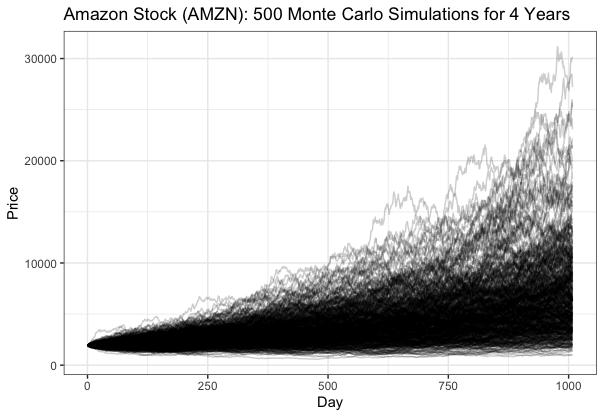

# Technical Analysis

A technical analysis on some of the biggest tech stocks using R: Amazon (AMZN), Facebook (FB), Tesla (TSLA), Apple (AAPL) and Google (GOOGL) & a price simulation using random walk and monte carlo. 

## Usage

- `library.R`
    - Packages used to complete the project

- `logreturn.R`
    - Log return of stocks from 2010-2020

- `plotlyvisual.R`
    - Visualization using `plotly` of a stock's risk vs return

- `chartseries.R`
    - Stock's latest movement
    - Bollinger bands
    - Percentage change in Bollinger
    - Volume
    - MACD (Moving Average Convergence Divergence)
    
    

- `return.R`
    - Stock distribution's daily return

- `correlation.R`
    - Correlation between the stocks

- `randomwalk.R`
    - Using `ggplot` to predict stock prices
    

- `montecarlo.R`
    - Using `ggplot` to replicate the random walk experiment to come up with a more accurate simulation
    
